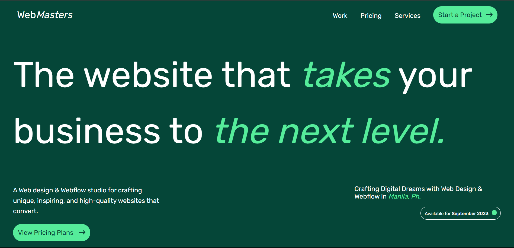

# WebMasters🟢 || Web Design🟩


A React project I'm building just for fun😁
 ```
# Web Masters || Web Design

This is a simple static website built with React.js and Vite. It is a one-page website with a pricing plan and a contact form.

## Prerequisites

To run this project, you will need the following:

* Node.js v16 or later
* npm v7 or later
* A text editor or IDE

## Installation

1. Clone the repository to your local machine.

```
git clone https://github.com/your-username/web-masters.git
```

2. Install the dependencies.

```
npm install
```

3. Start the development server.

```
npm run dev
```

The development server will run on port 3000. You can access the website by visiting http://localhost:3000 in your web browser.

## Code Structure

The code for this project is located in the `src` directory. The main file is `main.jsx`. This file contains the React components for the website.

The `style.css` file contains the CSS styles for the website.

The `assets` directory contains the images and other assets used by the website.

## Usage

To use this website, simply visit http://localhost:3000 in your web browser. You can then click on the different links to navigate the website.

## Deployment

To deploy this website, you can use a static hosting service such as Netlify or GitHub Pages.

## Contributing

If you would like to contribute to this project, please feel free to submit a pull request.

## License

This project is licensed under the MIT license.
```

Generated by [BlackboxAI](https://www.useblackbox.ai)
